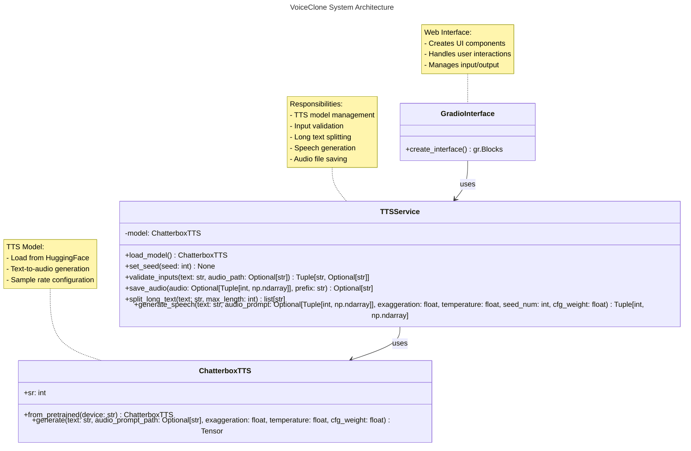
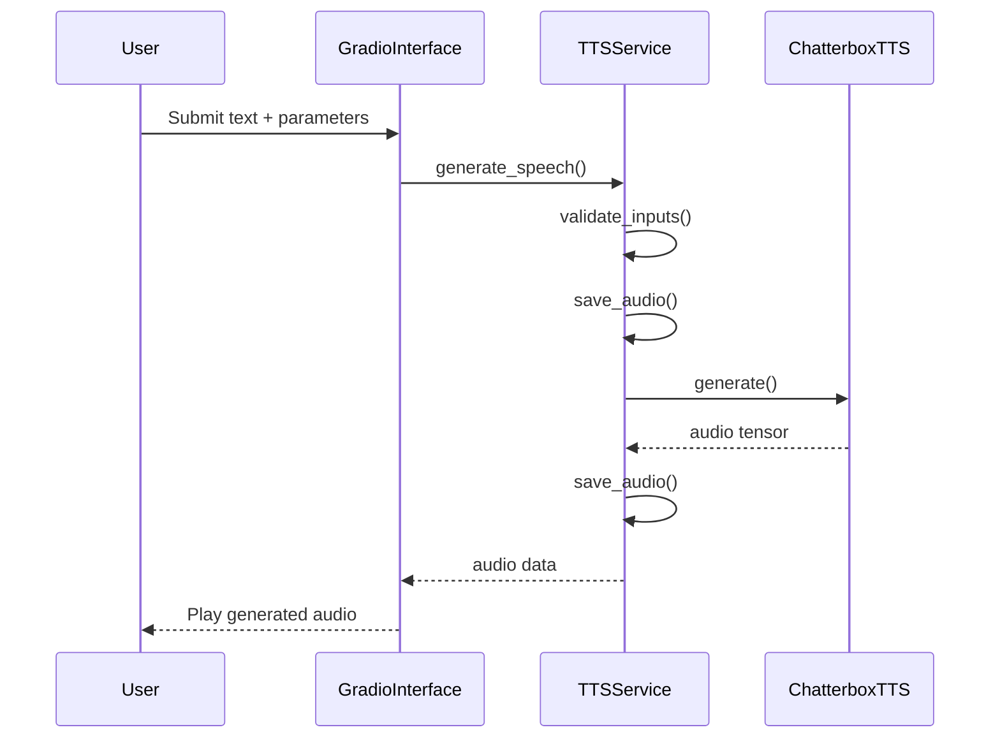

.

# 🎤 VoiceClone - Unlimited Chatterbox

A state-of-the-art voice cloning and text-to-speech system with **unlimited prompt length** support, powered by AI. Pretrained model from English Language.

## ✨ Key Features

- **🚀 Unlimited prompt length** - Generates speech from text of any length (automatic chunk processing)
- 🎙️ High-quality voice cloning from reference audio
- ⚡ Fine-grained generation controls (temperature, pacing, expressiveness)
- 💾 Automatic audio saving in organized sessions
- 🌐 Web interface with Gradio (supports microphone/web upload)

## 🏆 Why Choose This?

Unlike most TTS systems with strict character limits, our solution:
- **No arbitrary text limits** - Process books, long articles, etc.
- Smart chunking preserves natural prosody across segments
- CPU-compatible for wider accessibility
- Preserves voice characteristics across long generations


## Demos


<video controls width="500">
  <source src="/img/demo-1.mp4" type="video/mp4">
  Votre navigateur ne supporte pas les vidéos HTML5.
</video>


- [Your all Life is just a dream!](/img/demo-2.mp4)
- [We have a Job offer right!](/img/demo-2.mp4)
- [Chicken boy!](/img/demo-2.mp4)

# 🛠️ Installation

## with Docker

1. Install and Launch Docker on your system (https://www.docker.com/)
2. Build & launch the container
```bash
docker-compose up
```
3. Usage on your local browser (http://localhost:7860/)

Note: first use is longer (loading weight model) and the others quicker (dividing time by 4 with cache)  

## with Sources

0. if not exist, install uv for fast package installation:
(https://docs.astral.sh/uv/getting-started/installation)

1. create python env
```bash
uv venv .venv --python=3.12
.venv\Scripts\activate
``` 
2. install python packages
```bash
uv pip install -r requirements.txt

# install the right release pf Pytorch depending of your CUDA Toolkit release (here cu118)
uv pip install torch torchvision torchaudio --index-url https://download.pytorch.org/whl/cu118
```
3. Lanch the app and use
```bash
python main/app.py
```

## Technical Architecture
### UML architecture diagram

### Main workflow

### Key Components Explanation:

   1. TTSService: Core service class handling:
        - TTS model lifecycle
        - Input validation and processing
        - Long text segmentation
        - Audio generation pipeline
        - File management

   2. ChatterboxTTS: Voice synthesis model wrapper:
        - Pretrained model loading
        - Text-to-speech conversion
        - Audio configuration

   3.  GradioInterface: Web UI builder:
        - Creates interactive components
        - Manages user events
        - Displays results